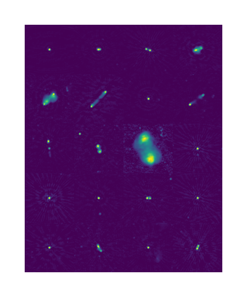

# LOFAR Master's Code Demos


## Week 1

- `week1_spectral_index.py` requires LoTSS, VLASS and NVSS catalogues
- `week1_cutouts.py` requires low-res EDFN image and catalogue - [https://lofar-surveys.org/deepfields_public_edfn.html](https://lofar-surveys.org/deepfields_public_edfn.html)

To make the file structure work you need to have CATALOGUES, CUTOUTS, IMAGES and PLOTS directories.


You also need to have `astropy`, `numpy`, `scipy` and `matplotlib` installed

e.g `pip install astropy numpy scipy matplotlib`

You can run the code by  :

```bash
python week1_spectral_index.py # Cross match catalogues and plot spectral indices

python week1_cutouts.py # Make cutouts of the brightest sources in EDFN
```

The first script contains code to do the cross matching - this is very memory and computation heavy and takes around 45 seconds to run on my laptop. If you already have a file called `CATALOGUES/lotss_vlass_nvss_matched.fits` then it will only do spectral index work and runs in ~1 second. You can create that file by running the script or prepare it yourself using topcat. 

The second script is quite fast and produces 20 cutouts in ~3 seconds. You might want to experiment with what slows down or speeds up the script. (Hint: if you remove plotting, it can produce over 350 cutouts a second!)

The second script will produce an image like this:

